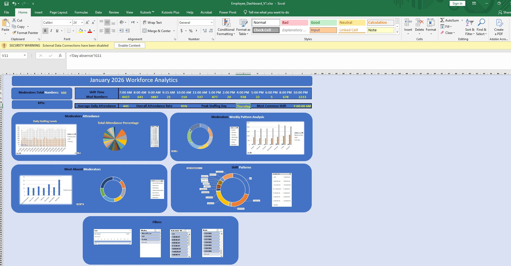
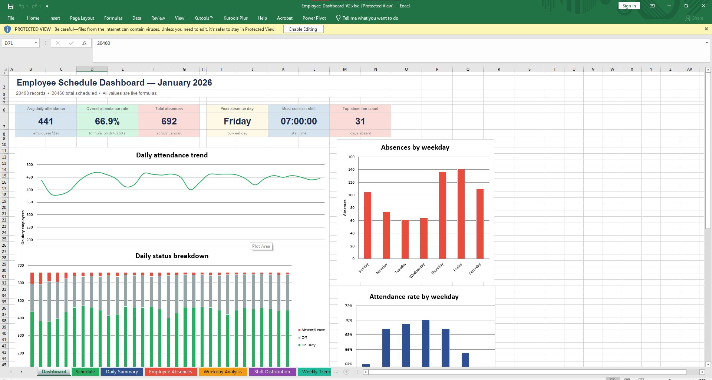
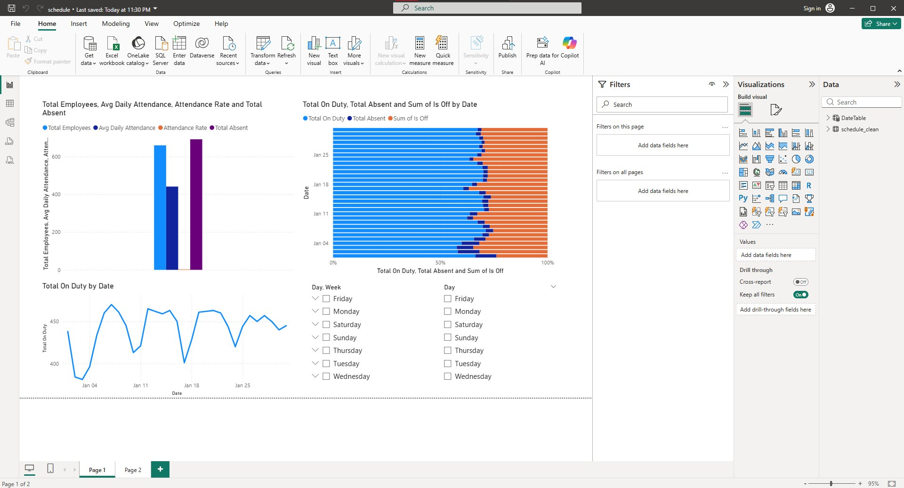

# Employee Schedule Analytics — January 2026

A multi-tool workforce analytics project analyzing **20,460 scheduling records** across **660 employees** for January 2026. The same dataset is analyzed using **Excel, SQL, and Power BI** to demonstrate proficiency across the core data analyst toolkit.

---

## Project Overview

| Metric | Value |
|---|---|
| Total Records | 20,460 |
| Employees | 660 |
| Period | January 1–31, 2026 |
| Overall Attendance Rate | 66.9% |
| Total Absences | 692 |
| Peak Staffing Day | Thursday |
| Most Common Shift | 07:00 AM |

### Key Findings

- **Friday has the highest absence count** (141 absences), while Wednesday has the best attendance rate (70.0%).
- **Morning shifts dominate** at 66.6% of all on-duty assignments, followed by Night (20.5%) and Afternoon (12.9%).
- **Week 1 had 237 absences**, dropping to just 70 by Week 5 — a **70% improvement** over the month.
- **5 employees were absent all 31 days** (100% absence rate), flagging potential long-term leave or data issues.
- The 07:00 AM shift is the most assigned with **3,975 assignments** across the month.

---

## Tools Used

| Tool | Purpose | File |
|---|---|---|
| **Excel** | Dashboard with KPIs, charts, pivot tables, and interactive filters | `Employee_Dashboard_V1.xlsx`, `Employee_Dashboard_V2.xlsx` |
| **SQL (MySQL)** | Data import, validation, aggregation, subqueries, pivot queries | `EMPLOYEES.sql` |
| **Power BI** | Interactive report with slicers, DAX measures, and date table | `schedule.pbix` |

---

## Excel Dashboard

### Version 1 — Visual-Heavy Layout

The first version focuses on a dense, chart-heavy layout with shift distribution breakdowns, attendance donut charts, and absence rankings all on a single dashboard sheet.



**Features:**
- KPI cards: Average Daily Attendance (441), Overall Attendance Rate (95% of scheduled), Peak Staffing Day (Thursday), Most Common Shift (7:00 AM)
- Shift time distribution across 12 time slots
- Daily staffing levels bar chart
- Attendance percentage donut chart
- Most absent moderators bar + donut chart
- Shift pattern breakdown (Morning / Afternoon / Night)
- Interactive filters: Date, Status, Schedule Hours, Date range

---

### Version 2 — Clean Analytical Layout

The second version uses a cleaner structure with separated analysis sheets and properly formatted charts. All values are driven by live formulas.



**Features:**
- KPI row: Avg Daily Attendance (441), Overall Attendance Rate (66.9%), Total Absences (692), Peak Absence Day (Friday), Most Common Shift (07:00), Top Absentee Count (31 days)
- Daily attendance trend line chart
- Absences by weekday bar chart
- Daily status breakdown stacked bar chart (On Duty / Off / Absent)
- Attendance rate by weekday chart
- Multiple analysis sheets: Schedule, Daily Summary, Employee Absences, Weekday Analysis, Shift Distribution, Weekly Trends

---

## SQL Analysis

The SQL script (`EMPLOYEES.sql`) works with a single `schedules` table and covers:

**Data Validation**
- Row count verification (20,460)
- Status breakdown check (On duty: 13,684 / Off: 6,084 / Absent: 692)
- Unique employee count (660)
- Daily record consistency (660 per day)
- Sum integrity check (is_working + is_off + is_absent = total)

**Analysis Queries**
- **KPI Overview** — all key metrics in one query
- **Daily Summary** — attendance and absence rates per day
- **Weekday Analysis** — aggregated by day of week with ordered output
- **Shift Distribution** — shift start times ranked by frequency, with window functions for percentages
- **Weekly Trends** — week-over-week attendance tracking
- **Employee Absence Ranking** — top 20 most absent employees

**Advanced Queries**
- **Subquery** — employees with above-average absence (using nested aggregation in HAVING)
- **Pivot Query** — attendance by week × day using `SUM(CASE WHEN...)` pattern
- **Comprehensive KPI** — single query combining scalar subqueries for worst day and top shift

---

## Power BI Report



**Page 1:**
- KPI cards: Total Employees, Avg Daily Attendance, Attendance Rate, Total Absent
- 100% stacked bar chart: On Duty vs Absent vs Off by weekly date
- Line chart: Total On Duty by Date (daily trend)
- Day/Week slicers for interactive filtering

**Page 2:** Additional breakdowns (shift patterns, employee-level details)

**Data Model:**
- `schedule_clean` table (imported from CSV)
- `DateTable` (DAX-generated for proper time intelligence)

---

## Dataset

The source file `schedule_data_sql_import.csv` contains 20,460 rows with the following columns:

| Column | Description |
|---|---|
| `ID` | Employee ID |
| `Name` | Employee name |
| `Date` | Schedule date (2026-01-01 to 2026-01-31) |
| `Day` | Day of week |
| `Schedule Start` | Shift start time |
| `Schedule End` | Shift end time |
| `Lunch Start` | Lunch break start |
| `Lunch End` | Lunch break end |
| `Status` | On duty / Off / Absent/Leave |
| `Week` | Week number (1–5) |
| `Is Working` | Binary flag (1/0) |
| `Is Absent` | Binary flag (1/0) |
| `Is Off` | Binary flag (1/0) |
| `Shift Category` | Morning / Afternoon / Night / Off / Absent |

---

## Project Structure

```
├── README.md
├── schedule_data_sql_import.csv      # Source dataset (20,460 rows)
├── EMPLOYEES.sql                     # MySQL analysis script
├── Employee_Dashboard_V1.xlsx        # Excel dashboard — visual layout
├── Employee_Dashboard_V2.xlsx        # Excel dashboard — clean layout
├── schedule.pbix                     # Power BI report
└── screenshots/
    ├── excel_dashboard_v1.png
    ├── excel_dashboard_v2.png
    └── powerbi_dashboard.png
```

---

## How to Use

**Excel:** Open either `.xlsx` file in Excel. V2 has live formulas — enable editing if prompted.

**SQL:** Run `EMPLOYEES.sql` in MySQL. Update the `LOAD DATA` file path to match your local CSV location. Run `SET GLOBAL local_infile = 1;` first if needed.

**Power BI:** Open `schedule.pbix` in Power BI Desktop. Data is embedded — no external connection needed.

---

## Author

Ahmad Omar — Mechanical Engineer | Data Analyst | 8+ years in internet marketing & content operations

Built as a portfolio project demonstrating the ability to analyze the same dataset across multiple industry-standard tools.
